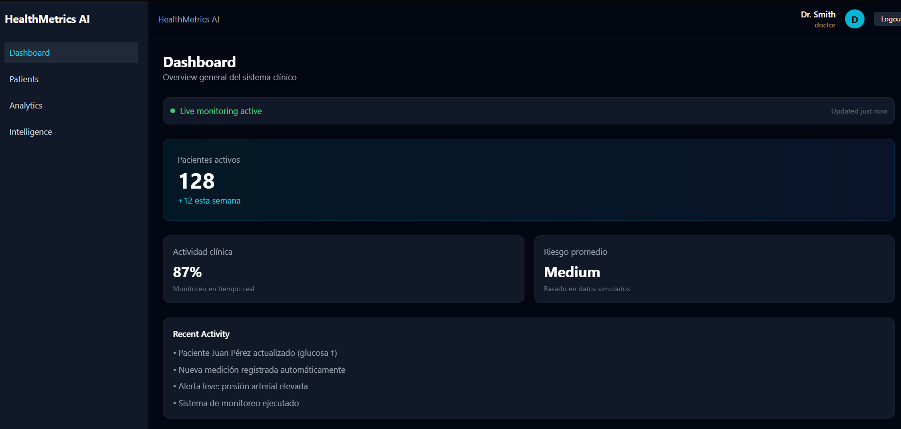

# 🩺 HealthMetrics AI

Dashboard SaaS para monitoreo clínico desarrollado con React, Vite y TailwindCSS.



---

## Descripción

HealthMetrics AI es un prototipo frontend inspirado en plataformas modernas de monitoreo clínico y análisis de datos de salud.

El proyecto busca simular una experiencia SaaS profesional mediante dashboards, métricas clínicas, visualización de datos y una arquitectura escalable orientada al crecimiento futuro de la aplicación.

> Actualmente utiliza datos simulados y no está destinado a uso clínico real.

---

## Funcionalidades

### Dashboard Clínico

* KPIs de monitoreo
* Estado general del sistema
* Indicadores clínicos
* Activity Feed
* Diseño tipo SaaS

### Analytics

* Gráficos interactivos con Recharts
* Tendencias clínicas simuladas
* Métricas de glucosa
* Métricas de presión arterial

### Autenticación

* Login simulado
* Gestión de sesión con Context API
* Protección de rutas

### Experiencia de Usuario

* Diseño moderno
* Dark Mode
* Navegación lateral
* Responsive base
* Componentes reutilizables

---

## Tecnologías Utilizadas

### Frontend

* React
* Vite
* TailwindCSS
* React Router DOM
* Recharts
* Framer Motion

### Herramientas

* pnpm
* Git
* GitHub

---

## Arquitectura

```txt
src/
│
├── app/
│   ├── layout/
│   ├── providers/
│   └── router/
│
├── assets/
├── components/
├── context/
├── data/
├── features/
├── hooks/
├── services/
├── store/
├── styles/
├── utils/
│
├── App.jsx
├── App.css
├── index.css
└── main.jsx
```

---

## Instalación

```bash
git clone https://github.com/TU-USUARIO/healthmetrics-ai.git

cd healthmetrics-ai

pnpm install

pnpm dev
```

Aplicación disponible en:

```txt
http://localhost:5173
```

---

## Objetivo del Proyecto

Este proyecto fue desarrollado como parte de mi portafolio personal con el objetivo de demostrar conocimientos en:

* Desarrollo Frontend con React
* Arquitectura modular
* Diseño de interfaces SaaS
* Visualización de datos
* Experiencia de usuario (UX/UI)
* Organización escalable de aplicaciones

---

## Próximas Actualizaciones

### Dashboard

* Hero Widget principal
* Mejor jerarquía visual
* Widgets clínicos avanzados
* Dashboard Premium

### Gestión de Pacientes

* Registro de pacientes
* Perfil clínico
* Historial médico
* Timeline de eventos

### Inteligencia Artificial

* Clinical AI Insights
* Predicción de riesgos
* Detección de anomalías
* Analítica predictiva

### Backend

* API REST
* Firebase
* Supabase
* Persistencia de datos

### Funcionalidades

* Exportación PDF
* Agenda médica
* Notificaciones en tiempo real
* Gestión de usuarios y roles

---

## Autora

**Sabrina Jeria Figueroa**

Frontend Developer
